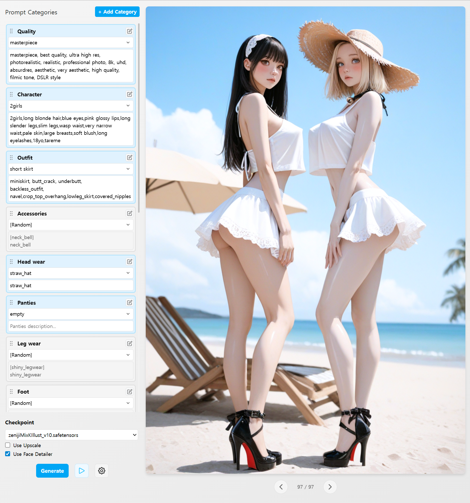

# Toon Maker

Toon Maker is a SvelteKit-based web application that integrates with ComfyUI for AI character art generation. Create diverse character images through category-based prompts.



## Installation

### 1. Install Dependencies

```bash
npm install
```

### 2. ComfyUI Setup

This application requires a local ComfyUI instance:

- ComfyUI must be running at `http://127.0.0.1:8188`
- The following nodes must be installed:
  - SaveImageWebsocket
  - FaceDetailer
  - [WildDivide](https://github.com/Julian-adv/WildDivide)
  - Other standard ComfyUI nodes

### 3. Development Server

```bash
npm run dev
```

Or to automatically open in browser:

```bash
npm run dev -- --open
```


## Key Features

- **Multi-category prompts** - Quality, character, outfit, pose, background categories
- **AI image generation** - Real-time progress with ComfyUI integration
- **20,000+ Danbooru tags** - Auto-complete suggestions for prompts
- **Image navigation** - Browse generated images with metadata restoration
- **Category management** - Add, edit, delete categories with drag & drop


